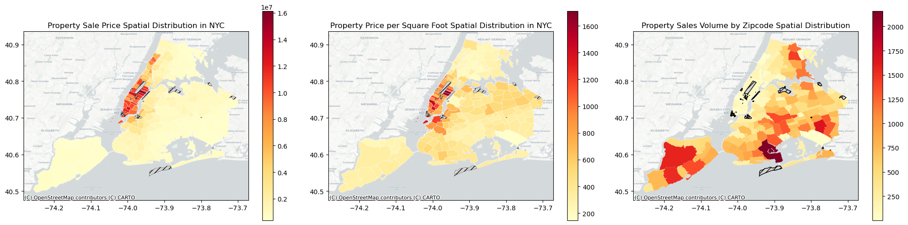
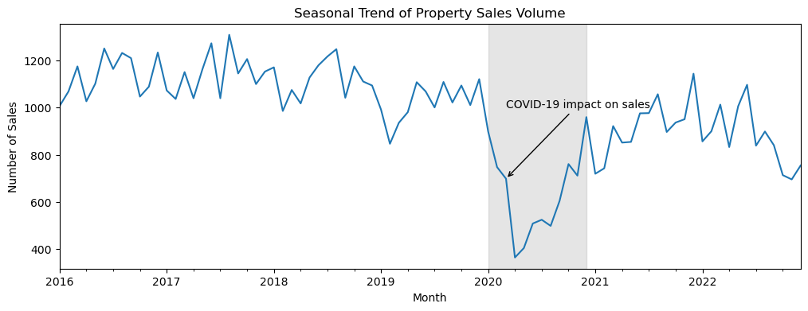

# NYC Property Price

## Background

In New York City, where the property market is always hopping, getting the price right when you're buying or selling a house can be really tricky. Prices bounce up and down because of so many things – like if a new park opens up or if there's a sudden rush of homes for sale. It's like trying to hit a moving target! And if you get it wrong, it can cost you big, like missing out on your dream home or not getting the cash you expected when you sell.

Everyone in the game, from the folks looking to buy a place to call home, to the ones selling, and the realtors in the middle, needs to know what a fair price looks like. It's a big deal because it helps everyone make smart choices and not lose money. The trouble is, figuring out that "just right" price isn't easy. You've got to juggle a lot of info – old prices, what the neighborhood's like, and all sorts of trends.

So, what we're doing is giving our prediction tools a serious upgrade. We want to make them smarter, so they can take all that info and make sense of it, almost like a weather forecast for house prices. That way, people can plan better, make decisions with confidence, and feel good about the deals they're making. It's all about making the market a bit friendlier and helping everyone play the game a little better.

## Goal

Build a predictive model to estimate property prices in NYC.

## Dataset

The dataset are gathered from various sources.

**The datasets**

| Dataset  | Source  |  Variable Name in Notebook | Category  |   |
|---|---|---|---|---|
|  Property Sales (2011-2022) |  [NYC Department of Finance](https://www.nyc.gov/site/finance/taxes/property-rolling-sales-data.page) | propertySales  | Housing  |   |
|  School Location |  [NYC Open Data](https://data.cityofnewyork.us/Education/2019-2020-School-Locations/wg9x-4ke6) |  school_location | Infrastructure  |   |
|  Bus Stop Shelter | [NYC Open Data](https://data.cityofnewyork.us/Transportation/Bus-Stop-Shelters/qafz-7myz)  | bus_stop_shelter  | Infrastructure  |   |
|  Health Facility | [HEALTH.DATA.NY.GOV](https://health.data.ny.gov/Health/Health-Facility-Map/875v-tpc8)  | health_facility_map  |  Infrastructure |   |
|  Park Properties |  [NYC Open Data](https://shorturl.at/lqLU1) | park_properties  | Infrastructure  |   |
|  Park Zones | [NYC Open Data](https://shorturl.at/fgtX6) | parks_zones  | Infrastructure  |   |
|  NYC Core Data | Many links from [NYC Core](https://coredata.nyc/) | df_nyc_core  |   |   |
| PLUTO (Land Use) |  [NYC Planning](https://www.nyc.gov/site/planning/data-maps/open-data/dwn-pluto-mappluto.page)|  pluto_23v3 | Geographic (Land Use)  |   |
|  NYC Zip Code |  [NYC Open Data](https://data.cityofnewyork.us/download/i8iw-xf4u/application%2Fzip) | zipcode  | Spatial Administrative  |   |
|  BBL (Borough, Block, Lot) | [NYC Open Data](https://dropbox.com/s/l8q8xm82wkhytod/BBL.csv?dl=1)  | BBL  |  Spatial Administrative |   |
|  Neighborhood | [NYC Open Data](https://data.cityofnewyork.us/api/geospatial/cpf4-rkhq?method=export&format=GeoJSON)  | neighborhood  | Spatial Administrative  |   |

The metadata after data cleaning can be seen through [this link](https://docs.google.com/spreadsheets/d/1NHvIAH6mABrFXmAoesHrzvaRmt5a5I7zCIHHoVLQOSA/edit?usp=sharing)

## Project Approach

### ML Development Steps

#### 1. Data Preparation

**Goals**: Understand the data and prepare the data for the next steps

**Definition of done**: 1_data_preparation.ipyb run properly, `propertySalesPrep.csv` are created

**What have been done here**: data filtering, data cleansing, data merging, convert data to geospatial, buffer and intersect

#### 2. Data Inspection

**Goals**: Determine preprocessing and feature engineering strategies

**Definition of done**: 2_inspection.ipynb run properly, splitted dataset (train, valid, test) are created

**What have been done**: variables type checking, missing data checking, data range checking, skewed data checking, data distribution, correlation, t-test, imbalance label checking, outliers checking

#### 3. EDA

**Goals**: Generate business insights

**Definition of done**: 3_eda.ipynb run properly, Charts and insights for presentation are created

**What have been done here**: trend (time series) analysis, geographical analysis, comparatie market analysis

### 4. Linear Regression

**Goals**: do inferential and predicition using most simple algorithm 

**Definition of done**: 4_regression.ipynb run properly

**What have been done here**:

### 5. Modeling

**Goals**: Get the best model for production

**Definition of done**: 5_modeling.ipynb run properly, the best model is created

**What have been done here**: preprocessing for modeling, train and evaluate vanilla mode, choose best vanilla model for production, try optimize with hyperparameters tuning, choose best model for production model

## Result

